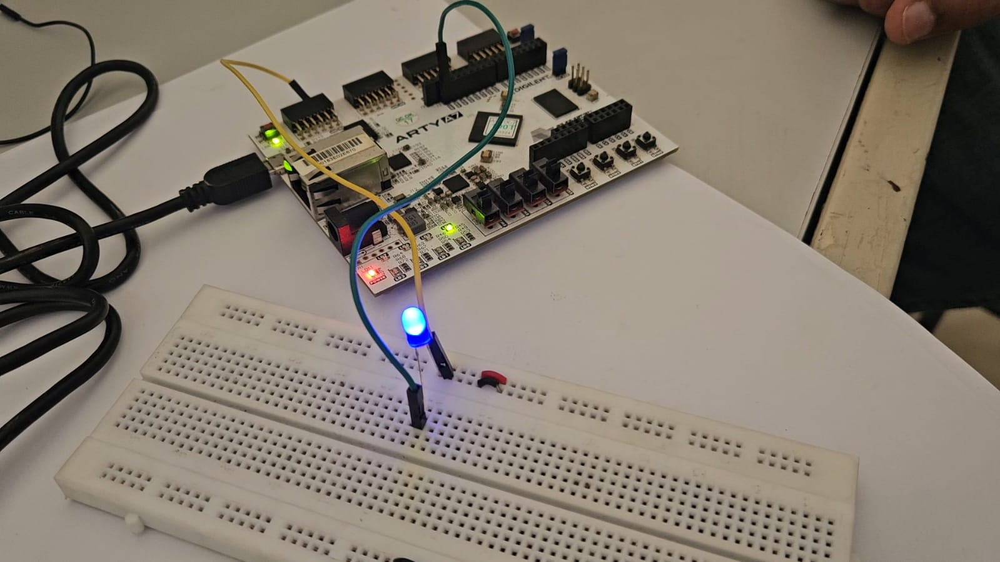

# Design-and-Implementation-of-PWM-Using-RISC-V-Processor-
Design and implementation of a Pulse Width Modulation (PWM) system using a RISC-V processor. Includes design, simulation, and testing for applications like motor control and embedded systems, with FPGA-based verification.

Pulse Width Modulation(PWM) is widely used in 
various applications, including embedded systems, VLSI, and 
power management circuits, for precise control of signals such as 
motor speed regulation and power efficiency optimization. This 
work focuses on integrating a PWM module with a RISC-V SoC 
using GPIO-based communication, enabling efficient hardware- 
level control without requiring complex software processing. The 
PWM module receives external control signals to modify the 
duty cycle, allowing real-time speed control. This implementation 
ensures a simple yet effective design, eliminating the need for 
complex interfacing mechanisms. Hardware validation confirms 
the system’s reliability and responsiveness, making it suitable 
for VLSI and embedded applications that require precise and 
efficient power management. This work demonstrates the feasibility of direct PWM integration with RISC-V processors, 
providing a foundation for further enhancements in real-time 
control applications.

## Methodology

This project implements a **PWM-based DC Motor Control System** using the **VEGA ET1035 RISC-V processor** on the **Arty A7 FPGA** platform. The workflow integrates hardware-level PWM generation with real-time software control for precise duty cycle modulation.

###  Hardware Design (Verilog)
- Designed a Verilog module to generate PWM signals for motor speed and LED brightness control.  
- Implemented **counter-based logic** to define ON/OFF durations based on the duty cycle.  
- Ensured modularity for easy integration with other SoC components.
- Simulated and verified the PWM module’s functionality to ensure correct signal generation and duty cycle control.

<!--   -->

When programmed onto the FPGA, the RISC-V processor writes duty cycle values to the PWM register using a C program compiled with the Vega SDK. These values directly update the PWM hardware logic, which controls LED brightness and DC motor speed in real time.

The project demonstrates hardware-software co-design, combining RTL design, embedded programming, SoC integration, and FPGA prototyping.

# PWM Duty Cycle Behavior
| Duty Cycle (%) | LED Brightness  | DC Motor Speed |
| -------------- | --------------- | -------------- |
| 0%             | OFF             | Stopped        |
| 30%            | Dim             | Slow           |
| 50%            | Medium          | Moderate       |
| 70%            | Bright          | Fast           |
| 100%           | Full Brightness | Maximum Speed  |

# Requirements
- *Arty A7* FPGA Board (100T)
- *Vivado 2024.1*([Vivado 2024.1 User Guide](https://hthreads.github.io/classes/embedded-systems/labs/assets/guides/VivadoGuide2024_1.pdf).)
- *VEGA Tools SDK* (for RISC-V ET1035 compilation)
- *Tera Term* (Windows) or *Minicom* (Linux) (for UART bootloader + XMODEM transfer)
- *MicroUSB Cable* (for UART interface)
- *LEDs* and *DC Motor* (connected to FPGA outputs)

# Demo Setup
## Hardware

- Arty A7 board connected to PC via USB.
- PWM output pins connected to an LED and DC motor driver.

## Software

- *Vivado* (run TCL script to generate .xpr)
- *Vega SDK + Makefile* (to build RISC-V .bin)
- *UART Terminal (Tera Term / Minicom)* (for bootloader transfer)

 # Steps to Run the Demo

## 1. Generate Vivado Project from TCL Script

- Open *Vivado 2024.1*.  
- In the *Tcl Console*, run the following command:
> 💡 Example :
text
source ./scripts/create_project.tcl

## 2. Build the Bitstream

- Open the generated project in *Vivado*.  
- Click *Generate Bitstream*. 
 - `.bit` — Bitstream for FPGA programming.  
  - `.bin` — Binary file stored in non-volatile memory for persistent configuration. 
- Program the FPGA with the .bit file: 
> 💡 Example :
text
./vivado_proj/ET1035_PWM.runs/impl_1/PWMdemo.bit

## 3. Compile RISC-V Program with Makefile

- Navigate to the Software folder:  
> 💡 Example :
text
 cd sw

- Ensure the PWM base address (assigned during port mapping in hardware) is correctly defined in:

  - *config.h* → ccontains memory map (e.g., '#define PWM_BASE_ADDR 0x10400000') 
  - *pwm.h* →wraps the PWM register structure with '#define pwm_reg (((volatile PWM_REG)(PWM_BASE_ADDR)))'
    

  - *pwm.c* → contains functions (e.g., pwm_set_duty(int value)) that write duty cycle values to the mapped register
    > 💡 Example :
    text
    typedef struct {
    unsigned int DUTY_CYCLE;
    } PWM_REG;
    #define pwm_reg (*((volatile PWM_REG*)(PWM_BASE_ADDR)))
    
- Once configuration files are correct, run:  
 > 💡 Example :
text
make

This compiles all sources (main.c, pwm.c, uart.c) and links them with Vega SDK libraries.  
- The final RISC-V binary will be generated as:  

 > 💡 Example :
text
    pwm_test.bin

## 4. Load Program via UART Bootloader  

- Open a UART terminal (e.g., *Tera Term/ **Minicom*) at 115200 baud.  
- Reset the FPGA → Bootloader banner will appear.  
- Select *Send File → XMODEM → pwm_test.bin*.  
- The bootloader copies the program into program memory.  
- Execution starts automatically, and *PWM duty cycle control* begins.  

## 5. Observe the Output  

- *LED brightness* changes smoothly as duty cycles update.  
- *DC motor speed* varies in proportion to PWM values.
# Additional Notes
  ## Generating Bitstream and Programming the FPGA
  - Open the project in Vivado 2024.1 by double clicking on the included XPR file found at "<archive extracted location>/vivado_proj/Arty-A7-100-XADC.xpr".
  - In the Flow Navigator panel on the left side of the Vivado window, click Open Hardware Manager.
  - Plug the Arty A7-100T into the computer using a MicroUSB cable.
  - In the green bar at the top of the window, click Open target. Select "Auto connect" from the drop down menu.
  - In the green bar at the top of the window, click Program device.
  - In the Program Device Wizard, enter "<archive extracted location>vivado_proj/Arty-A7-100-XADC.runs/impl_1/XADCdemo.bit" into the "Bitstream file" field. Then click Program.
  - The demo will now be programmed onto the Arty A7-100T.

# Results  

## 1. PWM Simulation Results  

  

  

The developed PWM module was initially validated through simulation before deploying it to the FPGA. Icarus Verilog was used as the simulator, and GTKWave for waveform analysis. The PWM counter and duty cycle functionalities were thoroughly tested. The output waveforms clearly depicted the PWM signal toggling with expected duty cycle variations, ensuring accurate register updates and logic implementation.  

---

## 2. PWM Signal Verification on Oscilloscope  

  

  

The Verilog-based PWM module was instantiated in the RISC-V ET1035 SoC and tested on the Arty A7 FPGA board. The output waveform was analyzed using a cathode ray oscilloscope (CRO). By modifying the duty register in the C program, different duty cycles were generated, and the oscilloscope confirmed precise variations in pulse width, validating the correctness of the hardware PWM implementation.  

---

## 3. LED Brightness Control using PWM  

  

  

The PWM output was connected to an LED on a breadboard setup. Adjusting the duty cycle through the C code running on the RISC-V processor resulted in varying LED brightness levels. Increased duty cycles made the LED brighter, while reduced duty cycles dimmed it. This experiment successfully demonstrated seamless hardware-software integration and real-time control using PWM.  

### Video  
[Watch Video](Results/LED_video.mp4)  

---

## 4. DC Motor Speed Control using PWM  

  

  

The PWM signal was also interfaced with an L293D motor driver module to regulate a DC motor’s speed. By modifying the duty cycle from the processor, the average voltage supplied to the motor was controlled, thereby adjusting its rotational speed. Higher duty cycles increased the motor speed, while lower duty cycles slowed it down, confirming the designed PWM module’s effectiveness in real-world embedded applications.  

### Video  
[Watch Video](Results/motor_video.mp4)  

---

## 5. Smart Street Monitoring using PWM, IR, and LDR  

In addition to testing the PWM on the oscilloscope, LED, and DC motor, the project was extended to a practical application: a *Smart Street Monitoring System*. This setup utilized an **IR sensor** to detect vehicle presence and an **LDR sensor** to monitor ambient light levels. The RISC-V processor continuously read sensor data via GPIO, processed the conditions, and adjusted the PWM duty cycle accordingly. The PWM output then controlled the streetlight brightness:  

| Condition | PWM Duty Cycle | LED Behavior |
|------------|---------------|--------------|
| **Obstacle detected** + **no light** | **100%** | LED fully ON for maximum brightness |
| **Obstacle detected** + **sufficient light** | **70%** | LED partially ON |
| **No obstacle** + **light present** | **30%** | LED dimmed for power saving |
| **No obstacle** + **no light** | **50%** | LED at standby brightness |

This practical implementation highlights how the designed PWM hardware integrates seamlessly into a real-time embedded system. Combining *Verilog-based PWM design, RISC-V processor control, and sensor-driven feedback*, the project effectively demonstrates a complete hardware-software co-design for energy-efficient streetlight automation.  

### Video  
[Watch Video](Results/exhibition.mp4)  
